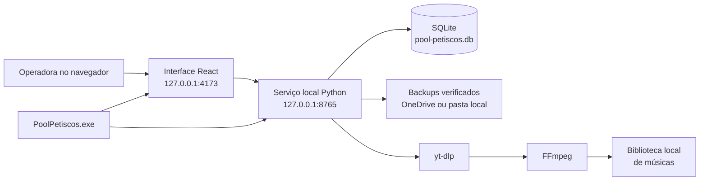

# Arquitetura do sistema

## Visão geral

O Pool Petiscos é um sistema local-first: o computador do caixa executa a
interface, o serviço de dados e o banco. Não existe dependência de um servidor
externo para registrar vendas ou movimentar estoque.

O executável `PoolPetiscos.exe` supervisiona os dois processos locais, aguarda
ambos ficarem prontos e só então abre o navegador. Se um processo terminar de
forma inesperada, o launcher tenta reiniciá-lo e registra o ocorrido em log.

## Fronteiras do código

| Diretório | Responsabilidade |
| --- | --- |
| `app/` | entrada da aplicação, metadados e estilos globais |
| `features/pool-petiscos/` | telas, estado de interface e regras do negócio |
| `local_service/` | API local, SQLite, músicas e launcher Windows |
| `installer/` | definição do instalador, ícone e dependências fixadas |
| `scripts/` | build, inspeção e empacotamento reproduzível |
| `tests/` | testes TypeScript e validação do artefato web |
| `docs/` | documentação do produto e da operação |

## Persistência

O estado atual é salvo de forma atômica em `app_state.state_json`. A aplicação
trata venda, baixa de estoque e caixa como uma única revisão; assim não há risco
de gravar apenas metade de uma operação. As últimas 50 revisões ficam em
`state_history`.

Para leitura humana, o banco cria consultas SQLite somente leitura:
`vw_produtos`, `vw_vendas`, `vw_itens_venda`, `vw_despesas`,
`vw_movimentos_caixa` e `vw_fechamentos_caixa`.

O navegador também mantém uma cópia de recuperação em `localStorage`. No
computador instalado, SQLite é a fonte principal. A cópia do navegador serve
somente para recuperar uma gravação pendente se o processo for fechado no
momento errado.

## Segurança local

- os serviços escutam somente em `127.0.0.1`;
- leitura e gravação do caixa exigem origem local;
- a demonstração hospedada não pode acessar o serviço, o banco ou as músicas
  instaladas;
- downloads rejeitam endereços de rede local;
- os estados recebidos têm limite de tamanho e validação integral;
- nenhuma credencial de banco, maquininha ou certificado fica no frontend ou no
  repositório.

## Aplicação hospedada

O Sites publica a mesma interface para demonstração. Sem o serviço instalado,
essa versão trabalha apenas com o armazenamento do navegador. Ela não substitui
o aplicativo Windows para operação real.
