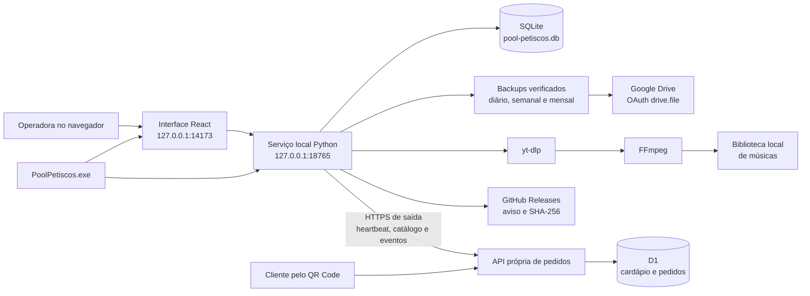

# Arquitetura do sistema

## Visão geral

O Pool Petiscos é um sistema local-first: o computador do caixa executa a
interface, o serviço de dados e o banco. Não existe dependência de um servidor
externo para registrar vendas ou movimentar estoque.

O executável `PoolPetiscos.exe` supervisiona os dois processos locais, aguarda
ambos ficarem prontos e só então abre o navegador. Se um processo terminar de
forma inesperada, o launcher tenta reiniciá-lo e registra o ocorrido em log.
No Windows, os processos filhos também pertencem a um grupo encerrado
automaticamente junto com o launcher, evitando servidores locais órfãos.

## Fronteiras do código

| Diretório | Responsabilidade |
| --- | --- |
| `app/` | entrada da aplicação, metadados e estilos globais |
| `features/pool-petiscos/` | telas, estado de interface e regras do negócio |
| `features/online-orders/` | cardápio público e regras de pedidos remotos |
| `cloud/` | API HTTPS própria executada no Worker |
| `db/` e `drizzle/` | esquema e migrações do banco de pedidos D1 |
| `local_service/` | API local, SQLite, músicas e launcher Windows |
| `installer/` | definição do instalador, ícone e dependências fixadas |
| `scripts/` | build, inspeção e empacotamento reproduzível |
| `tests/` | testes TypeScript e validação do artefato web |
| `docs/` | documentação do produto e da operação |

## Persistência

O estado atual é salvo de forma atômica em `app_state.state_json`. A aplicação
trata venda, baixa de estoque e caixa como uma única revisão; assim não há risco
de gravar apenas metade de uma operação. As últimas 12 revisões ficam em
`state_history`; como cada revisão contém o estado completo, esse limite evita
crescimento desnecessário do banco e os períodos maiores ficam nos backups.

Para leitura humana, o banco cria consultas SQLite somente leitura:
`vw_produtos`, `vw_vendas`, `vw_itens_venda`, `vw_despesas`,
`vw_movimentos_caixa`, `vw_fechamentos_caixa` e `vw_operadores`.

O navegador também mantém uma cópia de recuperação em `localStorage`. No
computador instalado, SQLite é a fonte principal. A cópia do navegador serve
somente para recuperar uma gravação pendente se o processo for fechado no
momento errado.

Pedidos recebidos pela internet ficam em tabelas `external_*`, separadas do
documento `app_state`. Um pedido pendente não altera venda, caixa nem estoque.
Somente a ação **Entregar e registrar venda** grava uma venda local com
`externalOrderId`; esse identificador impede duplicidade após repetição de
clique ou falha de rede. A confirmação remota usa uma outbox durável e pode ser
reenviada com segurança.

## Segurança local

- os serviços escutam somente em `127.0.0.1`;
- leitura e gravação do caixa exigem origem local;
- a demonstração hospedada não pode acessar o serviço, o banco ou as músicas
  instaladas;
- downloads rejeitam endereços de rede local;
- os estados recebidos têm limite de tamanho e validação integral;
- cada PIN é transformado no navegador em um verificador PBKDF2-SHA-256 com sal
  aleatório antes de ser persistido; o PIN legível não é gravado;
- a chave de recuperação do PIN segue a mesma regra e aparece apenas na criação;
- o Google Drive usa o escopo limitado `drive.file`; o token de atualização é
  protegido pela DPAPI do usuário Windows e nunca vai para o navegador;
- o canal de atualização aceita apenas releases do repositório oficial e só
  baixa o instalador quando nome, tamanho e SHA-256 publicados conferem;
- a execução do instalador é manual; o serviço local não inicia uma atualização
  silenciosa durante o atendimento;
- o PIN serve para identificar o operador local e não substitui a proteção da
  conta do Windows nem a criptografia do computador;
- nenhuma credencial de banco, maquininha ou certificado fica no frontend ou no
  repositório.
- o token da instalação do cardápio é protegido pela DPAPI do usuário Windows,
  nunca aparece no QR Code e só é enviado em conexões HTTPS de saída;
- preços, acréscimos e totais do pedido são recalculados no servidor; valores
  enviados pelo navegador do cliente não são aceitos como fonte de verdade;
- criação e mudança de pedidos usam chaves idempotentes, limites contra spam e
  uma máquina de estados validada também no banco.

As preferências de tema e tamanho das letras são específicas do dispositivo e
ficam no armazenamento do navegador. Elas não são dados do negócio e, por isso,
não entram no SQLite nem nos backups do caixa.

## Aplicação hospedada

A hospedagem publica o cardápio móvel e a API de pedidos. A área do caixa
continua local; o computador nunca abre uma porta para a internet e inicia toda
sincronização por HTTPS. Se a rede cair, vendas presenciais, caixa e estoque
continuam funcionando e as ações remotas pendentes ficam na outbox para nova
tentativa.

## Limites de escala

A arquitetura atual é intencionalmente local e voltada a um caixa principal.
Ela foi ensaiada com 41.600 vendas e 1.040 sessões, equivalentes a cerca de cinco
anos de uma operação pequena. Consultas e gravações permaneceram válidas, e os
backups compactos não carregam as revisões internas redundantes.

Se o negócio passar a usar vários caixas simultâneos ou acumular um volume muito
maior, vendas, itens e movimentos deverão migrar do documento atômico para
tabelas SQL normalizadas. Essa evolução não é necessária para o cenário atual,
mas está registrada como fronteira técnica, não como uma promessa de escala
ilimitada.
