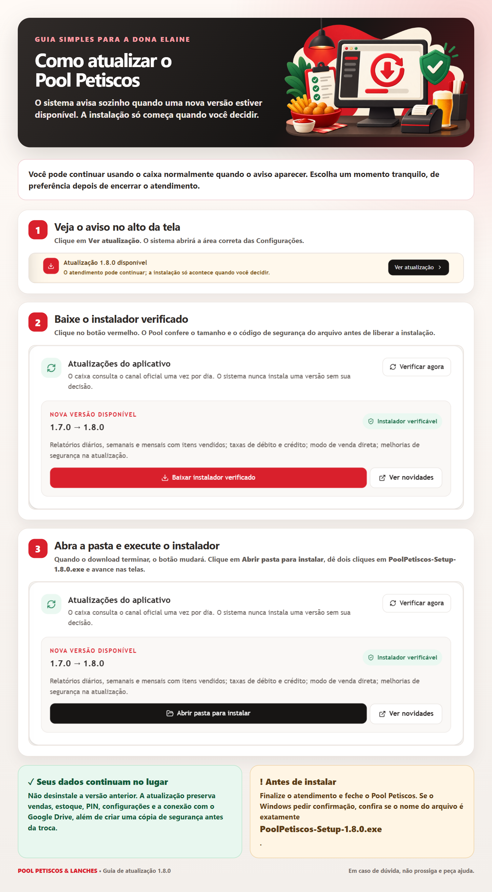

# Entrega da versão 1.8.0

A versão 1.8.0 amplia os relatórios de fluxo de caixa, registra os acréscimos
de cartão e permite adaptar o atendimento ao uso real da lanchonete. Ela também
reforça o aviso de atualização introduzido na versão 1.7.0.

## Relatórios

Em **Financeiro > Fluxo de caixa**, os proprietários podem consultar hoje, a
semana atual, o mês atual ou um período personalizado. Cada venda identifica:

- produtos vendidos e respectivas quantidades;
- observações dos itens;
- forma de pagamento;
- subtotal, acréscimo de cartão e total cobrado.

A mesma informação é preservada nos relatórios Excel e PDF. A data é gravada
com data e hora e a planilha ajusta a largura da coluna para evitar `########`.

## Débito, crédito e modo de atendimento

O sistema mostra antes da confirmação o acréscimo de 3% no débito e de 6% no
crédito. Pix e dinheiro continuam sem acréscimo.

Em **Configurações > Modo de atendimento**, é possível manter a fila de
comandas ou usar **Venda direta**. A mudança vale somente para as próximas
vendas e não apaga o histórico. Comandas em andamento precisam ser concluídas
antes de desativar a fila.

## Atualização segura

O aplicativo instalado consulta o release oficial uma vez por dia, inclusive
quando permanece aberto por vários dias. Se a internet falhar, o caixa continua
funcionando e tenta novamente depois.

O download só é oferecido quando nome, tamanho e SHA-256 do instalador são
válidos. Depois do download, a instalação permanece manual: a proprietária abre
a pasta, fecha o atendimento e executa o instalador por cima da versão atual.
Não se deve desinstalar a versão anterior.

Antes de substituir os arquivos, o instalador encerra os processos locais e
cria uma cópia verificada do SQLite. Vendas, estoque, PIN, configurações,
músicas, backups e conexão com o Google Drive ficam fora da pasta substituída e
são preservados.

## Guia para a proprietária

Arquivo para envio:
`docs/operations/assets/guia-atualizacao-pool-petiscos-1.8.0.png`.
